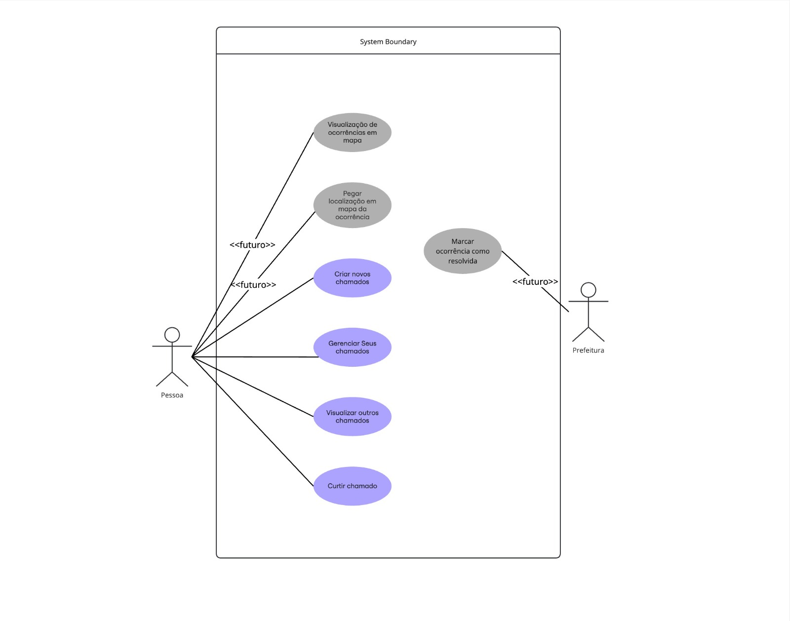

# InfraAlerta
---
### Site funcionando
    https://infra-alerta-production.up.railway.app/
---
Sistema onde qualquer pessoa vai conseguir registrar por meio de um formulário com informações básicas do local e assim informar algum problema de infraestrutura urbana pública de sua cidade.

---
## Rotas
https://infra-alerta-production.up.railway.app/

## EndPoints

 - GET  -> localhost:8080/
 - GET  -> localhost:8080/chamados/
 - POST -> localhost:8080/chamados/criar
 - POST -> localhost:8080/chamados/like/{id}
 - PUT  -> localhost:8080/chamados/update/{id}
 - DELETE -> localhost:8080/chamados/delete/{id}

## Casos de uso
